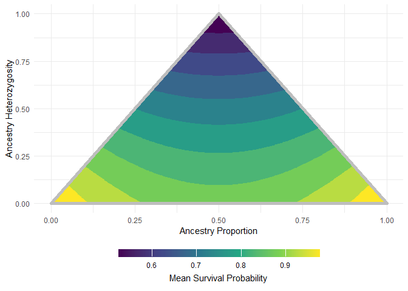

<!-- README.md is generated from README.Rmd. Please edit that file -->

# linecrossR

<!-- badges: start -->
<!-- badges: end -->

The goal of linecrossR is to fit and visualize hybrid fitness models.

## Installation

You can install the development version of linecrossR from
[GitHub](https://github.com/) with:

``` r
# install.packages("pak")
pak::pak("KnechtTheDots/linecrossR")
```

## Example

This is a basic example which shows you how to plot a fitness landscape
from a hypothetical Dobzhansky-Muller incompatibility:

``` r
library(linecrossR)

dmi_plot(h2 = .5, h1 = .5, h0 = .5)
```


